# Tarea 4 
## Kaseng Fong 
## B42609
### IE0405 - Modelos Probabilísticos de Señales y Sistemas  

Librerías útiles para este laboratorio: 

``` python

from scipy import stats
from scipy import signal 
from scipy import integrate 
import matplotlib.pyplot as plt 
import pandas as pd
import numpy as np
import csv

```


Se extae los bits del archivo y se guarda en un arreglo de la manera: 


``` python
#Se extrae los bits en un arreglo 
bits = []
with open ("bits10k.csv",'r') as X:
    lines = X.read().splitlines()

    for row in lines:
        bits.append(float(row))

```


## Parte 1 Generando la señal modulada BPSK

Estableciendo los parámetros para definir la frecuencia, la cantidad de muestra y los tiempos de muestreo para generar la señal portadora sinusoidal y la onda modulada de esta.  

``` python

#Definiendo los parametros para generar la senal modulada BPSK

#Definimos la frecuencia 
f = 5000 #Hz

# Periodo de cada bit modulado
T = 1/f 

#Número de muestras 
p = 50

tp = np.linspace(0,T,p)


#creación de la forma de onda de la portadora de amplitud unitario
sen = np.sin(2*np.pi*f*tp) 


#Numero de todos los bits 
N = len(bits)

# frecuencia de muestreo: aqui no existen las señales continuas 
#es el numero de muestras por segundo 
#determina la capacidad de recuperar toda la onda  y densisdad espectral de potencia 
fs =  p/T 


# Creación de la linea temporal para todas la señal Tx 
t = np.linspace(0,N*T,N*p)


#Inicializar el vector de señal 
#señal modulada 
senal = np.zeros(t.shape) #cada cada valor de señal a un valor de t 


#creación de la señal modulada BPSK, asi hacemos la modulaciones 
for k, b in enumerate(bits):
    senal[k*p:(k+1)*p] = np.cos(np.dot(2 * np.pi * fs, T) + np.pi * (b - 1) + np.pi / 4)*sen

```
Los valores se muestran en la siguiente tabla donde f es la frecuencia, T el peridodo. p el numero de muestras, N la cantidad de bits y fs la frecuencia de muestro.

| f  | 5000Hz    |
|----|-----------|
| T  | 2e-4 s    |
| p  | 50        |
| N  | 1000 bits |
| fs | 250e3 Hz  |


Con los parámetros definidos, se obtiene la visualización de la señal modulada BPSK de los primeros 10 bits.
La modulación "Binary Phase Shift Keying" es una tecnica de modulación que consiste cambiar el ángulo  la onda sinusoidal portadora cambiando ya sea 0 o 180 según el valor del bit. Para las primeras  10 bits muestras 
[0, 1, 0, 1, 0, 1, 1, 0, 1, 0] se obtiene la siguiente señal modulada donde para cada bit=1 la señal portadora cambia de fase.


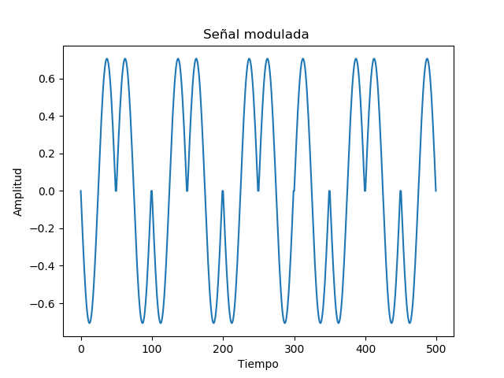


## Parte 2, calculando la potencia promedio

``` python

# Potencia instantánea
Pinstantanea = senal**2

# Potencia promedio a partir de la potencia instantánea 
Pm = integrate.trapz(Pinstantanea, t) / (N * T)

print("La potencia promedio es de : ",Pm)


```
de la cual se obtiene que la potencia promedio Pm = 0.24500049000096372

## Parte 3. Simulación de canal de ruido


Para simular el canal de ruido de tipo AWGN primero se guarda en una lista Rx_lista los valores de Rx generados en ese momento para cada nivel de SNR desde -2dB hasta los 3dB.### Canal ruidoso tipo AWGN, SNR = -2dB
``` python

SNR=np.arange(-2,4) #iniciar el vector del rango de decibeles para la SNR deseada

Rx_lista=[] #iniciar el vector que guarda el ruido RX de cada SNR en una lista para usarlo posteriormente en la parte 5.
 
#imprime la visualizacion de cada SNR en la señal portadora 
for i in SNR:
    Pn =0
    Pn = Pn +( Pm / (10**(i/10)))                           # Potencia del ruido para SNR y potencia de la señal dadas
    sigma = np.sqrt(Pn)                                     # Desviación estándar del ruido
    ruido = np.random.normal(0, sigma, senal.shape)         # Se simula la señal recibida en el canal 
    Rx = senal + ruido                                      # Se crea ruido a partir de (Pn = sigma^2)
    Rx_lista.append(Rx)                                     #Guardo cada RX generado en la lista RX_lista para usarlo en el error
    
    plt.plot(Rx[0:pb*p])# Visualización  del ruido de cada  SNR  individualmente de los primeros bits recibidos
    plt.xlabel('Tiempo')
    plt.ylabel('Amplitud')
    plt.title('Canal ruidoso de tipo AWGN con SNR desde -2dB a 3dB')

```
Se obtienen todas las señales con ruido desde los -2dB hasta los 3dB en una sola imagen donde se observa la señal modulada resultante con todos los niveles de SNR. 

### Canal ruidoso de todos los niveles de SNR
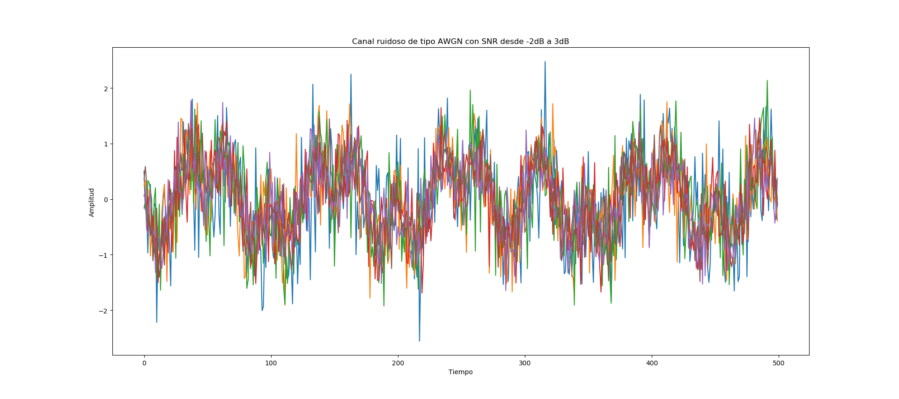


Ahora se analiza por separado cada valor de SNR obtenido para poder ser demodulado y decodificado en la parte 5 del laboratorio.

``` python
#imprime el vector de cada ruido RX en el canal con su respectivo SNR
for j in range(len(Rx_lista)):   
    Rx =Rx_lista[j]
    plt.figure()
    plt.plot(Rx[0:pb*p])
    plt.xlabel('Tiempo')
    plt.ylabel('Amplitud')
    title = "Canal ruidoso de tipo AWGN con SNR= {}dB".format(SNR[j])
    plt.title(title)
    print("\nPara el valor SNR={}dB  Se genera un ruido dado por=\n{}\n".format(SNR[j],Rx_lista[j]))

```
Se observa que conforme aumenta los dB, la señal se va volviendo más clara. 

### Canal ruidoso tipo AWGN, SNR = -2dB
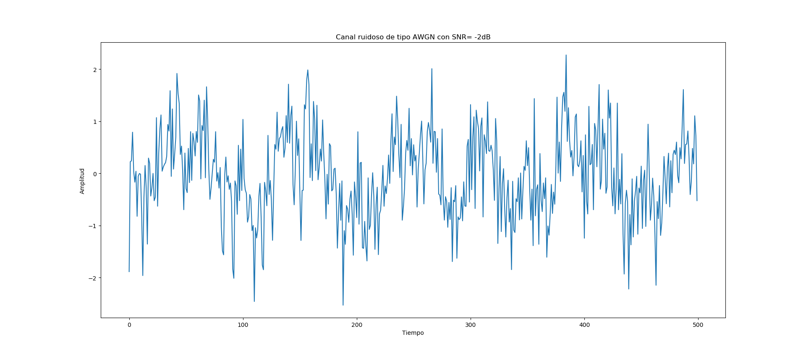

### Canal ruidoso tipo AWGN, SNR = -1dB
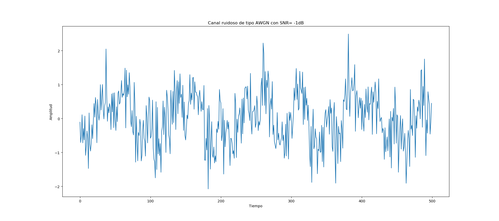
### Canal ruidoso tipo AWGN, SNR = 0dB
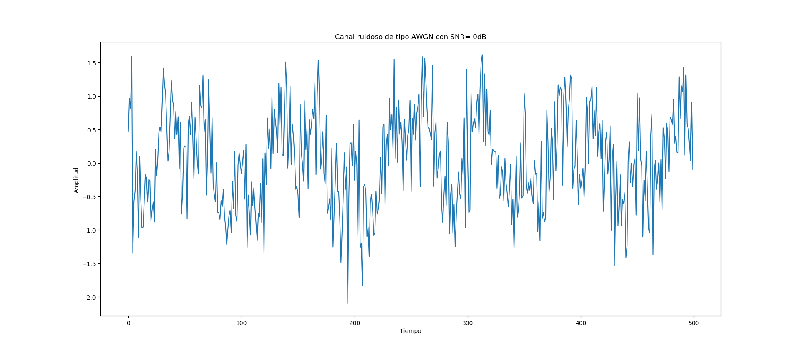
### Canal ruidoso tipo AWGN, SNR = 1dB
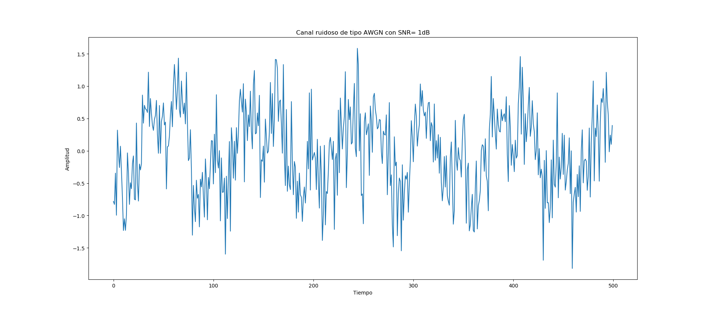
### Canal ruidoso tipo AWGN, SNR = 2dB
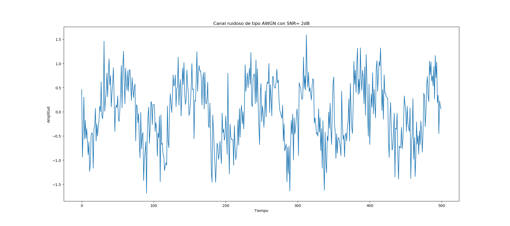
### Canal ruidoso tipo AWGN, SNR = 3dB
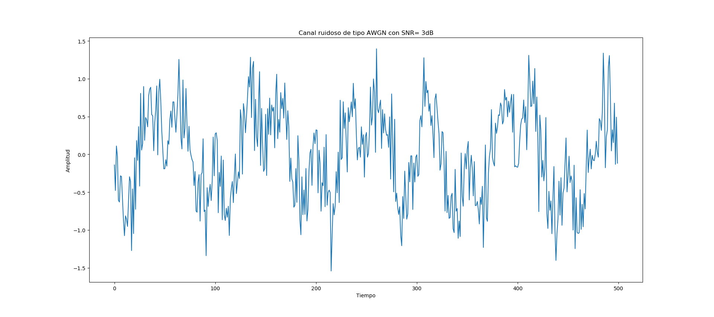


## Parte 4 Gráficando la densidad espectral de potencia

``` python
#Densidad espectral de potencia 

# Senal inicial antes de pasar por el canal ruidoso de la parte 3
fw, PSD = signal.welch(senal, fs, nperseg=1024)
plt.figure()
plt.semilogy(fw, PSD)
plt.xlabel('Frecuencia / Hz')
plt.ylabel('Densidad espectral de potencia / V**2/Hz')
plt.title('Antes del canal ruidoso')


# Senal cuando pasa por el canal ruidos.
fw, PSD = signal.welch(Rx, fs, nperseg=1024)
plt.figure()
plt.semilogy(fw, PSD)
plt.xlabel('Frecuencia / Hz')
plt.ylabel('Densidad espectral de potencia / V**2/Hz')
plt.title('Despues del canal ruidoso')

plt.show()
```

### La señal antes de pasar por el canal ruidoso
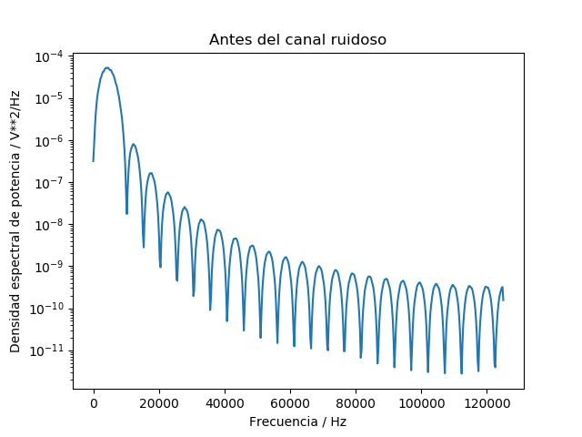
### La señal despues de pasar por el canal ruidoso
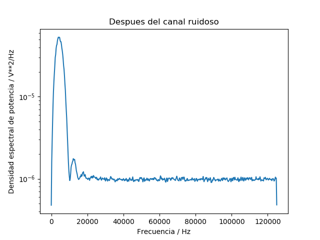


## Parte 5 Demodular y decodificar la señal

En esta sección se realiza la decodificación de la onda mediante el método visto en clase, de aquí se obtien la cantidad de bits que fueron recibidos según el canal de ruido a la que fueron trasmitidos.El valor de BER (bits error rate) es una medida para indicar que tan bueno es la transmisión de datos en cierto tiempo
los sistemas muy buenos tienen valores de BER = 10e-10 mientras que los peores (dañados) tiene un BER mayores a 10e-3. 

``` python
# Parte 5

bits_shape = np.shape(bits)# variable que me da la información de datos de los bits (bits.shape no funcionó)

# Pseudo-energía de la onda original
Es = np.sum(sen**2)

# Bits recibidos en este arreglo; 
bitsRx = np.zeros(bits_shape)

BER_lista=[] # guardo los valores de BER para utilizarlo en la parte 6

# Decodificación de la señal por detección de energía para cada SNR
for i in range(len(Rx_lista)): # Recorrer la lista obtenida del ruido RX de cada SNR del punto 3
    Rx=Rx_lista[i]
    for k, b in enumerate(bits):
        Ep = np.sum(Rx[k*p:(k+1)*p] * sen)
        
        if Ep > Es/2:
            bitsRx[k] = 1
        else:
            bitsRx[k] = 0

    err = np.sum(np.abs(bits - bitsRx))
    BER = err/N
    BER_lista.append(BER) # Lista del bit error rate para cada nivel de SNR
    
    print('Cuando la señal pasa por el canal con un ruido de SNR= {}dB entonces, la señal decodificada tiene un total de {} errores en {} bits con una tasa de error de {}.'.format(SNR[i],err, N,BER))# se obtienen todos los datos para graficar BRE VS SNR

```
En la tabla se observa que para cada nivel de SNR se obtuvieron los siguientes BER cabe destacar que se utilizó 50 muestras, el valor de BER varía  (disminuye) si las muestras aumentan.

| SNR dB | Error | BER    |
|--------|-------|--------|
| -2     | 257   | 0.0257 |
| -1     | 164   | 0.0164 |
| 0      | 109   | 0.0109 |
| 1      | 57    | 0.0057 |
| 2      | 31    | 0.0031 |
| 3      | 7     | 0.0007 |


## Parte 6 Gráfica BER VS SNR
Utilizando los niveles de SNR y los BER obtenidos como se observó en la tabla anterior, se puedo observar la gráfica correspondiente, donde se puede notar que a mayor dB el ruido es menor ya que la señal mejora y se obtiene un BER cada vez menor.  

``` python
plt.plot(SNR,BER_lista)  
```
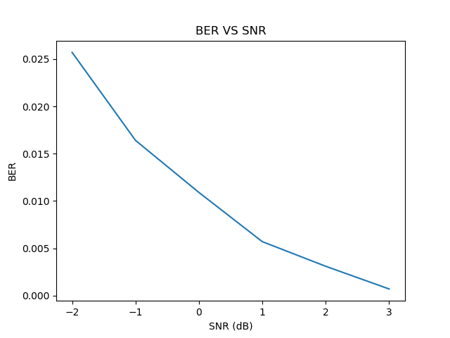
